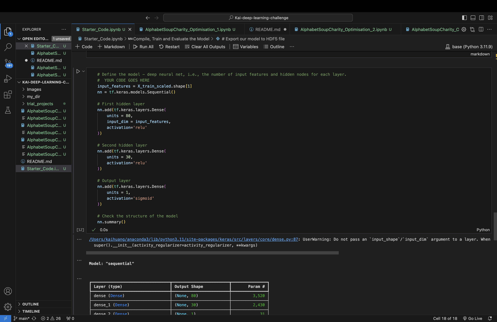
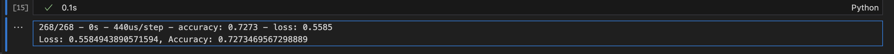

# Kai-deep-learning-challenge

## Overview of analysis
The goal of this analysis was to use machine learning and neural networks to create a tool capable of helping the Alphabet Soup, a nonprofit foundation, select funding applicants who are most likely to succeed in their startups. This analysis will use features from the provided dataset to create a binary classifier that predicts outcome of fund applicants. 

## Data preprocessing
- Target Variable(s):
    - The target variable for the model is 'IS_SUCCESSFUL'.

- Feature Variable(s):
    - The features for the model include:
        - APPLICATION_TYPE
        - AFFILIATION
        - CLASSIFICATION
        - USE_CASE
        - ORGANIZATION
        - STATUS
        - INCOME_AMT
        - SPECIAL_CONSIDERATIONS
        - ASK_AMT

- Variables Removed:
    - The input data has removed the variable 'EIN' and 'NAME'. Because they do not contribute to the predictive power of the model.

## Compiling, Training, and Evaluating the Model
- Neurons, Layers, and Activation Functions (Initial Model):
    - Number of Layers: 3 layers.
    - Input layer :
        - Neurons: 80
        - Activation: Relu
        - Input Dimensions: the shape of X_train_scaled

    - Hidden Layer:
        - Neurons: 30
        - Activation Function: Relu

    - Output Layer:
        - Neurons: 1
        - Activation Function: Sigmoid

- Initial Model Performance:
    - The initial model performance is lower than expected, the accuracy is only 72.73%

- Three ways to increase model performance:
    - First attempt is to add more neurons into layers.
    - Second attempt is to add more hidden layers in model.
    - Thrid attempt used Hyperparameter Optimization.Used Keras Tuner to perform hyperparameter tuning, adjusting the number of neurons, layers, and activation functions.

- The model after optimization still cannot perform higher accuracy.

## Summary

Despite achieving a noteworthy accuracy of 72.93% with the optimized model, it falls short of the 75% target, indicating the need for further testing and potential overfitting concerns. I recommend developing an alternative model and remove less impactful features. Testing new models with a streamlined feature set may achieve the desired 75% accuracy. The further exploration and refinement could potentially meet or exceed the benchmark.
